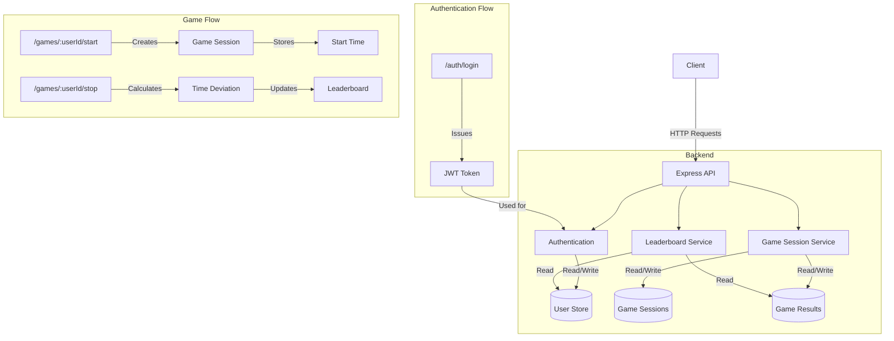
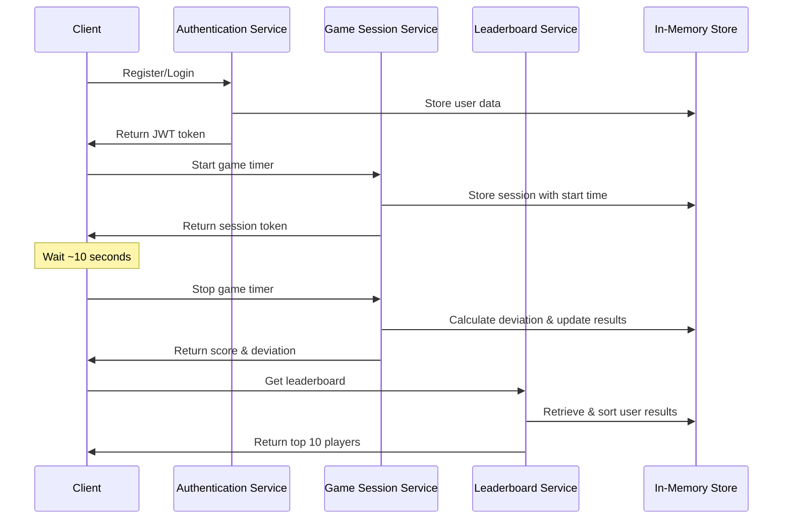
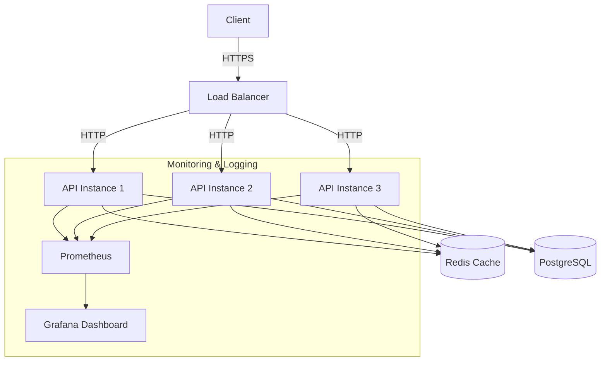

# System Architecture

## Component Diagram

## Data Flow

## Deployment Architecture

For a production environment, the following architecture would be recommended:

## Scalability Considerations

1. **Stateless API Design**
   - Each API instance can handle requests independently
   - Session state stored in Redis for fast access

2. **Database Scaling**
   - Read replicas for leaderboard queries
   - Connection pooling for efficient resource usage

3. **Caching Strategy**
   - Leaderboard results cached with time-based invalidation
   - User authentication status cached to reduce database load

4. **Load Balancing**
   - Round-robin distribution for even load
   - Health checks to route away from unhealthy instances
